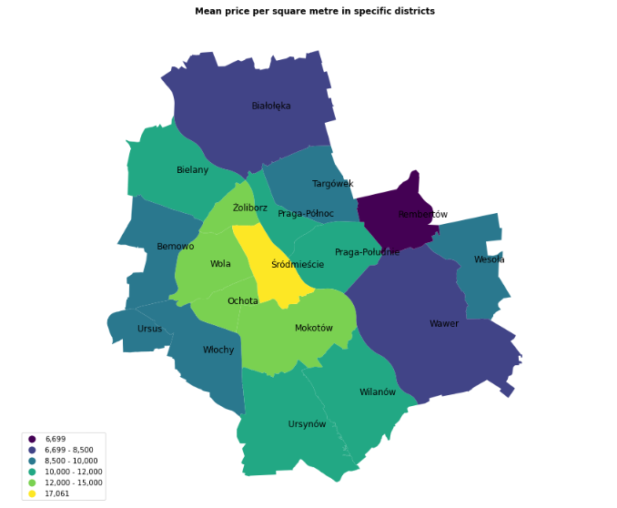
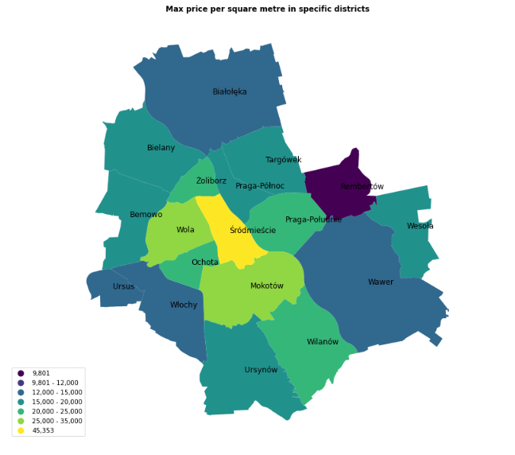
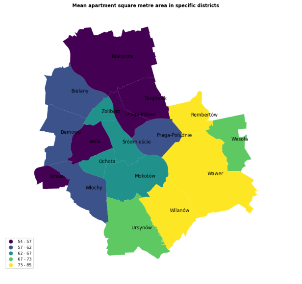
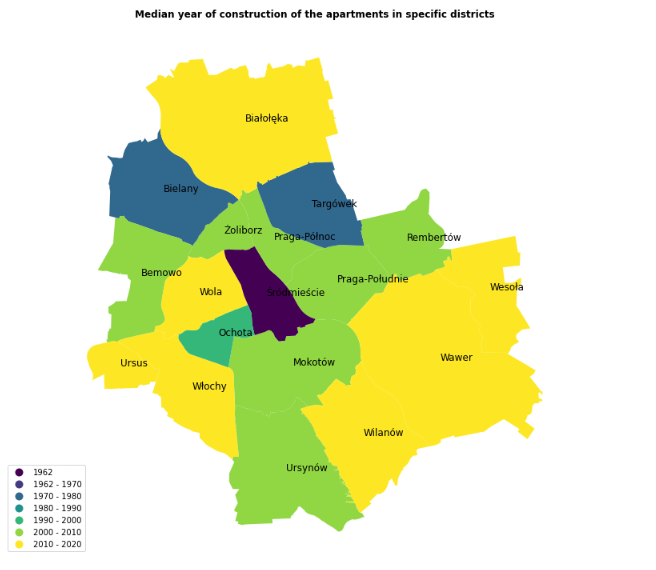
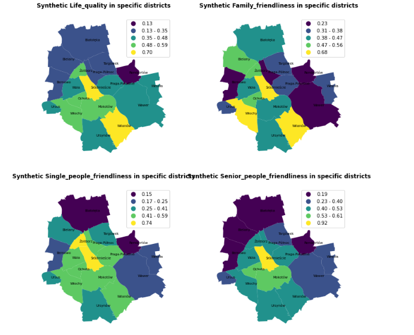

```{r echo=FALSE, warning=FALSE, message=FALSE}
packages_vector = c("knitr", "readxl", "kableExtra", "ggplot2", "rpart", "rattle", "mice", "dplyr","forcats", "spdep", "rgdal", "maptools", "sp", "RColorBrewer", "e1071", "spatstat", "GISTools", "caret", "sjPlot", "xgboost")

package.check <- lapply(packages_vector, FUN = function(x) {
  if (!require(x, character.only = TRUE)) {
    install.packages(x, dependencies = TRUE)
  }
})

library(knitr)
library(readxl)
library(kableExtra)
library(ggplot2)
library(rpart)
library(rattle)
library(mice)
library(dplyr)
library(forcats)
library(spdep)
library(rgdal)
library(maptools)
library(sp)
library(RColorBrewer)
library(e1071)
library(spatstat)
library(GISTools)
library(caret)
library(sjPlot)
library(xgboost)
```

<style>
body {
text-align: justify; 
font-size: 18px; 
line-height: 1.5em; 
}

p {
text-indent: 2em
}


div.figure { 

text-align: center; 
}


p.noindent {

text-indent: 0 !important;
}

table {

margin-left:auto; 
margin-right:auto;

}

</style>

```{r setup, include=FALSE}
knitr::opts_chunk$set(echo = TRUE)
```

```{r set-options, echo=FALSE, cache=FALSE}
options(width = 120)
```

# Introduction

Through the centuries people have invented unlimited variety of techniques and tools to invest money. Real-estate market is probably one of the oldest. It guarantees, seemingly, a perfect trade-off between cash, and something which allows to convert an abstract concept of money into more tangible thing – hectares of rural plots, houses etc. However, despite the lapse of time and hundreds of years the market exists in different forms, there are no perfect answers on what drives the prices of specific types of properties. Sometimes one can get an impression that the attempts to predict the housing prices, which are widely described around different media, are closer to some kind of guessing than any scientific approach. When the coronavirus pandemic in Poland and the lockdown related to it were in peak, one could read the interviews with real-estate experts who were claiming that the prices are not going to go down. For a relatively economic-conscious person such statements might be confusing. How can it be that all the markets are most likely to enter a recession and, at the same time, the prices of properties would increase? There is no easy answer to that question. Sometimes, the experts might be wrong on purpose, driven by their own speculative interest. However, what is clear is that there are many determinants of property prices, having their roots in different fields. Starting from the characteristics of properties, going through the situation on financial markets and ending with their influence on investing behavior of people. In this work characteristics of properties are a subject of analysis. 

The main objective of this study is to find determinants of prices of apartments in Warsaw. The relation between characteristics of specific property and its value on the online-market is analyzed. 
The data obtained from otodom.pl, which is one of the largest real-estate platforms in Poland, is combined with spatial and district characteristics. In this analysis multiple machine-learning methods, starting from OLS regression, through spatial-econometrics specific methods and ending with non-parametric models, are utilized. There are two main hypotheses verified in this work. 

<center><i><b> Hypothesis One </b></i></center>
<center><i> Spatial-based variables are significant predictors of housing-prices </i></center>

<br>

<center><i><b> Hypothesis Two </b></i></center>
<center><i> The coronavirus pandemic had a negative impact on the housing-prices </i> </center> 

# 1. Data

The dataset used in the analysis is created by the authors based on several sources. There are three general groups of variables: 

  * property characteristics 
  * spatial characteristics 
  * district characteristics. 

Property characteristics were obtained from otodom.pl website with the use of web scraping algorithm written in Python. All available features of apartments were collected from adverts, amid which address information is the key one from the perspective of this study. 
Spatial data includes distances from collected apartments to a few, arbitrary selected, points on a map of Warsaw. To measure the distances it was neccessary to employ publicly available APIs:

* Nominatim – Getting coordinates of a specific location, based on its address [^Nominatim]
* Project-OSRM – Based on coordinates, calculating distances [^Project-OSRM]

District characteristics, are captured with the measures able to reflect attractiveness of living conditions in particular Warsaw districts. The need to control for such variables was determined by literature overview, which proves that life-quality matters in the case of housing-prices [^D'Acci]. The life-quality measures were assessed from the report prepared by the Statistical Office in Warsaw [^gus]. 

<p class = "noindent"> Below table presents all the variables analyzed with its detailed descriptions. </p>

```{r warning=FALSE, message=FALSE}
df_final <- readxl::read_excel("df_final_v4.xlsx")
df_final$...1 <- NULL
```

```{r echo=FALSE, warning=TRUE, include=FALSE}
# supplementary code
colnames(df_final) <- c("District", "Total_price", "Days_from_initial_announcement", "Rent", "Ownership", "Floor", "Construction_type", "Finishing_condition", "No_of_floors", "Property_market", "Area", "No_of_rooms", "Year_built", "Heating", "Lat", "Lon", "Distance_to_PKIN_in_km", "Time_to_PKIN_in_minutes", "Price_per_sqm", "Population_density", "Vistula_side", "Life_quality", "Family_friendliness", "Single_people_friendliness", "Senior_people_friendliness", "Distance_to_subway_in_km", "Distance_to_airport_in_km")
```

<p class = "noindent"> <b> Table 1. </b> Variables and their description </p>

```{r echo=FALSE, warning=TRUE}
variables <- matrix(c(
  "District", "The district",
  "Total_price", "Total price of the property in PLN",
  "Days_from_initial_announcement", "Days from initial announcement appeared on the website",
  "Rent", "Rent",
  "Ownership", "Form of ownership",
  "Floor", "Floor",
  "Construction_type", "Type of construction",
  "Finishing_condition", "Finishing condition",
  "No_of_floors", "Number of floors in the building",
  "Property_market", "Property market (if primary or secondary)",
  "Area", "Living area of the property in squared metres",
  "No_of_rooms", "Number of rooms",
  "Year_built", "Construction completion year",
  "Heating","Heating type",
  "Lat","Latitude of the property",
  "Lon","Longitude of the property",
  "Distance_to_PKIN_in_km","Distance to the center (indicated by the PKiN building) in km",
  "Time_to_PKIN_in_minutes","Time to the center (indicated by the PKiN building) in minutes", 
  "Distance_to_subway_in_km","Distance to the nearest subway in km",
  "Distance_to_airport_in_km", "Distance to Chopin Airport in km",
  "Price_per_sqm","Price per square metre",
  "Population_density","Population density of district", 
  "Vistula_side(1_for_west_0_for_east)","Which side of the Vistula the property is located (1=West, 0=East)",
  "Life_quality","Life quality within a district",
  "Family_friendliness","Family friendliness within a district",
  "Single_people_friendliness","Single people friendliness within a district",
  "Senior_people_friendliness","Senior people friendliness within a district"
  ), 
  ncol=2,byrow=TRUE)
colnames(variables) <- c("Variable Name", "Variable description")
variables %>% 
  kable() %>% 
  kable_styling()
```

## 1.1. Data preparation

Raw data preparation and manipulation are presented in this section. There are three main areas that it covers: proper variables formatting, variables categorization and missing values treatment.

### 1.1.1. Variables formatting 

<p class = "noindent"> 

* Initial formatting of the variables was investigated.    
```{r}
nums <- sapply(df_final, is.numeric)
df_final_nums <- df_final[,nums]
kable(head(df_final_nums)) %>%
  kable_styling(bootstrap_options = c("hover", "responsive")) %>%
  scroll_box(width = "100%", height = "90%")
```
<br>

* For variables which are qualitative or binary, factor formatting is applied.
```{r}
oth <- which(!nums)
df_final_oth <- df_final[,oth]
kable(head(df_final_oth)) %>%
  kable_styling(bootstrap_options = c("hover", "responsive")) %>%
  scroll_box(width = "100%", height = "90%")
```

</p>

```{r}
df_final$District <- as.factor(df_final$District)
df_final$Ownership <- as.factor(df_final$Ownership)
df_final$Construction_type <- as.factor(df_final$Construction_type)
df_final$Finishing_condition <- as.factor(df_final$Finishing_condition)
df_final$Property_market <- as.factor(df_final$Property_market)
df_final$Heating <- as.factor(df_final$Heating)
df_final$Vistula_side <- as.factor(df_final$Vistula_side)
```

### 1.1.2. Features engineering

In the next stage, categorization of numerical variables takes place. The variable cuts are imposed based on: 

* A relationship between the dependent variable, being Price_per_sqm, and variable of interest
* Splits obtained with the decision tree algorithm. 

<p class = "noindent"> <b> Number of floors </b> </p>

<p class = "noindent"> <b> Figure 1. </b> Number of floors vs Price per sqm </p>
```{r warning=FALSE}
ggplot(df_final, aes(x = No_of_floors, y = Price_per_sqm)) + 
  geom_point(color="#FDE733") +
  theme_minimal()
```

<p class = "noindent"> <b> Figure 2.</b> Levels of variable Number of floors suggested by Decision Tree algorithm </p>
```{r warning=FALSE, message=FALSE}
formula <- Price_per_sqm ~ No_of_floors
tree1 <- rpart(formula, data = df_final, control=rpart.control(minsplit=10, cp=0.002, maxdepth = 3))
fancyRpartPlot(tree1, palettes = "Spectral")
```

```{r}
df_final$No_of_floors_binned <- 
  ifelse(df_final$No_of_floors < 2, "<= 2", 
       ifelse(df_final$No_of_floors > 2 & df_final$No_of_floors <= 4, "> 2 & <= 4",
              ifelse(df_final$No_of_floors > 4 & df_final$No_of_floors <= 28, "> 4 & <= 28", 
                     ifelse(df_final$No_of_floors > 28, "> 28", 0))))

df_final$No_of_floors_binned <- as.factor(df_final$No_of_floors_binned)
```

 
<p class = "noindent"> <b> Construction completion year </b> </p>

<p class = "noindent"> When analyzing variable indicating construction completion year, three outliers were noticed which seemed to be caused by mistyping and corrected. Additionally, decision has been made to create and use in the further modelling a variable indicating age of the building instead of the year it was built. </p>


```{r}
df_final$Year_built <- ifelse(df_final$Year_built==19885, 1985, df_final$Year_built)
df_final$Year_built <- ifelse(df_final$Year_built==20112, 2012, df_final$Year_built)
df_final$Year_built <- ifelse(df_final$Year_built==20110, 2010, df_final$Year_built)

df_final$Building_age <- 2020 - df_final$Year_built
```

<p class = "noindent"> <b> Figure 3. </b> Age of the apartment vs Price per sqm </p>
```{r warning=FALSE}
ggplot(df_final, aes(x = Building_age, y = Price_per_sqm)) + 
  geom_point(color="#FDE733") +
  theme_minimal()
```

<p class = "noindent"> <b> Figure 4.</b> Levels of variable Age of apartment suggested by Decision Tree algorithm </p>
```{r}
formula <- Price_per_sqm ~ Building_age
tree2 <- rpart(formula, data = df_final, control=rpart.control(minsplit=10, cp=0.002, maxdepth = 3))
fancyRpartPlot(tree2, palettes = "Spectral")
```

```{r}
df_final$Building_age_binned <- 
  ifelse(df_final$Building_age <= 0, "<= 0", 
       ifelse(df_final$Building_age > 0 & df_final$Building_age <= 12, "> 0 & <= 12",
              ifelse(df_final$Building_age > 12 & df_final$Building_age <= 64, "> 12 & <= 64", 
                     ifelse(df_final$Building_age > 64 & df_final$Building_age <= 105, "> 64 & <= 105",
                            ifelse(df_final$Building_age > 105, "> 105", 0)))))

df_final$Building_age_binned <- as.factor(df_final$Building_age_binned)
```

<p class = "noindent"> <b> Days from the initial announcement </b> </p>
```{r, results = 'hide'}
df_final$Days_from_initial_announcement <- ifelse(df_final$Days_from_initial_announcement=="Less than a day", 0, df_final$Days_from_initial_announcement)
df_final$Days_from_initial_announcement <- as.integer(df_final$Days_from_initial_announcement)
```

<p class = "noindent"> <b> Figure 5. </b>Days from initial announcement vs Price per sqm  </p>
```{r warning=FALSE}
ggplot(df_final, aes(x = Days_from_initial_announcement, y = Price_per_sqm)) + 
  geom_point(color="#FDE733") +
  theme_minimal()
```
<p class = "noindent"> <b> Figure 6. </b> Levels of variable Days from initial announcement of apartment suggested by Decision Tree algorithm  </p>
```{r, results = 'hide'}
df_final$Days_from_initial_announcement_binned <- 
  ifelse(df_final$Days_from_initial_announcement == 0, "Less than a day", 
       ifelse(df_final$Days_from_initial_announcement > 0 & df_final$Days_from_initial_announcement <= 7, "Week or less than a week",
              ifelse(df_final$Days_from_initial_announcement > 7 & df_final$Days_from_initial_announcement <= 30, "Month or less than a month", 
                     ifelse(df_final$Days_from_initial_announcement > 30 & df_final$Days_from_initial_announcement <= 365, "Year or less than a year",
                            ifelse(df_final$Days_from_initial_announcement > 365, "Over a year", 0)))))

df_final$Days_from_initial_announcement_binned <- as.factor(df_final$Days_from_initial_announcement_binned)
```

<p class = "noindent"> <b> Floor </b> </p>
```{r, results='hide'}
df_final$Floor <- as.factor(df_final$Floor)
levels(df_final$Floor)
```

<p class = "noindent"> <b> Figure 7. </b> Count of specific levels of Floor of apartment  </p>
```{r warning=FALSE}
df_final %>% 
  group_by(Floor) %>% 
  count %>% 
  ggplot(aes(x = Floor, y = n)) + 
  geom_bar(stat = "identity", fill = "orange") +
  theme_minimal()
```

```{r, results = 'hide'}
df_final$Floor_binned <- df_final$Floor
levels(df_final$Floor_binned) <- c("> 10","=> 1 & <= 5","> 5 & <= 10","=> 1 & <= 5","=> 1 & <= 5","=> 1 & <= 5","=> 1 & <= 5","> 5 & <= 10","> 5 & <= 10","> 5 & <= 10","> 5 & <= 10","parter","poddasze","suterena")
levels(df_final$Floor_binned)
```

<p class = "noindent"> <b> Number of rooms </b></p>
```{r, results = 'hide'}
df_final$No_of_rooms <- as.factor(df_final$No_of_rooms)
levels(df_final$No_of_rooms)
```

<p class = "noindent"> <b> Figure 8. </b> Count of specific levels of Number of rooms in apartment  </p>
```{r}
df_final %>% 
  group_by(No_of_rooms) %>% 
  count %>% 
  ggplot(aes(x = No_of_rooms, y = n)) + 
  geom_bar(stat='identity', fill = "orange") +
  theme_minimal()
```

```{r, results = "hide"}
df_final$No_of_rooms_binned <- df_final$No_of_rooms
levels(df_final$No_of_rooms_binned) <- c("1","2","3 or more","3 or more","3 or more","3 or more","3 or more","3 or more","3 or more","3 or more")
levels(df_final$No_of_rooms_binned)
```

### 1.1.3. Treatment of missing values 

This section addresses missing data treatment. In Table 2 variables with missing values are presented along with the missing values ratio. 

<p class = "noindent"> <b> Table 2. </b> Missing values </p>
```{r}
missings <- as.data.frame(colMeans(is.na(df_final))) 
missings["Variabe"] <- row.names(missings)
colnames(missings) <- c("Missings_ratio", "Variable")
missings %>% 
  dplyr::filter(Missings_ratio > 0.001) %>% 
  dplyr::select(Variable, Missings_ratio) %>%
  kable() %>% 
  kable_styling()
```

<p class = "noindent"> For qualitative variables like: form of ownership, floor, type of construction, finishing condition, heating, number of floors in the building, building age and floor, the decision has been made to make missing values an explicit factor level. </p>

```{r warning=FALSE, message=FALSE, results='hide'}
f_names <- c("Ownership", "Floor", "Construction_type", "Finishing_condition", "Heating", "No_of_floors_binned", "Building_age_binned", "Floor_binned")

df_final[,f_names] <- lapply(df_final[,f_names], function(x) fct_explicit_na(x, na_level = "Missing")) %>% as.data.frame
``` 

<p class = "noindent"> As to qualitative variables, the decision to fill the value of Rent with Predictive according to Mean Matching algorithm has been made. Value of rent depends on many external factors such as type of the entity managing the building, living area, number of people living in the property, type of heating (e.g. if urban then it is contained in the rent, if gas then it is paid separately to the gas plant). The decision has been made to use as a proxy of these factors the living area, number of rooms and also type of heating. </p>

```{r results='hide', warning=FALSE, message=FALSE}
formula <- make.formulas(df_final[,c("Rent","Area","No_of_rooms_binned","Heating")])
imp <- mice(df_final[,c("Rent","Area","No_of_rooms_binned","Heating")],
            m=5,
            method="pmm",
            formulas = formula,
            seed=1234)

rent_imp <- rowMeans(imp[["imp"]][["Rent"]])
names(rent_imp) <- NULL

df_final$id <- 1:dim(df_final)[1]
miss_rent <- df_final %>% filter(is.na(Rent))
nonmiss_rent <- df_final %>% filter(!is.na(Rent))
nonmiss_rent$rent_imp <- NA

df_final_1 <- cbind(miss_rent, rent_imp)
df_final_2 <- rbind(nonmiss_rent, df_final_1)

df_final_2$Rent_imp <- ifelse(is.na(df_final_2$Rent), rent_imp, df_final_2$Rent)
df_final_2 <- df_final_2 %>% dplyr::select(id, Rent_imp)
df_final <- left_join(df_final, df_final_2, by="id") %>% dplyr::select(-id)
```

# 2. Exploratory Data Analysis

After the final data has been obtained there was a possibility to look at relations between selected variables and the districts of Warsaw. Figure 1 presents mean price per square metre of apartments in specific districts

<b>Figure 9.</b> Mean price per square metre in specific districts of Warsaw
<br>
<div class = "figure"> 
\ 
</div>

Rembertów, which is an east-border district of Warsaw occured to be the cheapest one place to live in the city in mean values. At the same time, Śródmieście, being the central region, has the highest mean prices, almost 3 times as high as in Rembertów.    

<b>Figure 10.</b> Max price per square metre in specific districts of Warsaw
<br>
<div class = "figure"> 
\ 
</div>

The same pattern as in the case of mean prices, can be spotted for max prices. Again, Rembertów is clearly the cheapest one district and Śródmieście is the most expensive. The relation between two extreme districts is even more visible. Max prices in Śródmieście are about 5 times higher than in Rembertów. 

From the analysis of mean and maximum prices a picture of Warsaw apartments market can be drawn. The prices, in general, increase to the central part of the city. Additionaly, the market is quite differentieted. One can also get an impression that the apartments located on the east side of the Vistula river are cheaper. Therefore, <b><i> Auxiliary Hypothesis One </i></b> is proposed. <br>


<center><i><b> Auxiliary Hypothesis One </b></i></center>
<center><i> The prices of the apartments located on the east side of Vistula river are, in general, cheaper </i></center> <br>


<b>Figure 11.</b> Mean apartment square metre area in specific districts of Warsaw
<br>
<div class = "figure"> 
\
</div>

Mean apartment square area is a variable which delivers an interesting view on a differentation of square metres of apartments in districts. The south districts seem to have higher means of square metres of apartments. 

<b>Figure 12.</b> Median year of construction of the apartments in specific districts of Warsaw
<br>
<div class = "figure"> 
\ 
</div>

Median year of construction can show how Warsaw evolved in time. The process, without suprise, escalated from the center of city - Śródmieście with apartments older than 50 years (with median threshold) to the borders of Warsaw, but not with the same speed.    

<b>Figure 13.</b> Life quality measures in specific districts of Warsaw
<br>
<div class = "figure"> 
\ 
</div>

Life quality measures were introduced to capture the determinants of housing-prices widely present in the literature. Here, again we can spot the relation, which was identified for prices of square metres of apartments. Rembertów is the worst district in the case of presented measures and Śródmieście is on the top. Based on this observation, <b><i> Auxiliary Hypothesis Two</i></b> is introduced. <br>


<center><i><b> Auxiliary Hypothesis Two </b></i></center>
<center><i> There is a siginficant relation between prices of apartments and life quality measures in specific districts Warsaw</i> </center><br>  

# 3. Modelling

Due to the nature of main hypotheses stated in Introduction, and Auxiliary hypotheses from Section 2, the modelling part is done separately for each hypothesis. Different modelling strategies are applied for a purpose of verification. The problem captured with the <b><i> Hypothesis One </i></b> is addressed with multiple modelling approaches, including OLS, spatial methods, and non-parametric algorithm. For the rest of hypotheses, their, relatively simple functional form, makes the OLS regression enough to conduct a meaningful verification process. In each subsection, after the modelling, the results of it are discussed and hypothesis is definitely verified.       

## 3.1. Hypothesis One

<center><b><i> Hypothesis One </i></b> </center> 
<center><i> Spatial-based variables are significant predictors of housing prices </i></center <br <br>

In order to estimate housing prices, several models have been run. There are three types of models which are considered: regular OLS regression, spatial algorithm and non-parametric algorithm. 

### 3.1.1. OLS Regression

First model run is linear regression with only spatial characteristics as independent variables. Stepwise regression in order to obtain the best model formula according to AIC criterion is employed. 

```{r}
ols_0 <- lm(Price_per_sqm ~ Distance_to_PKIN_in_km + Distance_to_subway_in_km + Distance_to_airport_in_km,
          data=df_final)
```

The adjusted R-squared of the model is 31.4%. All variables occurred to be significant according to p-value statistic.  The model shows the negative relationship of the price per squared metre with distance to PKiN and distance to subway and positive relationship with distance to airport. The results are intuitive - the prices of properties are indeed higher in the centre and near subway station as it increases the property functionality, while prices of properties near airports are lower due to aircraft noise.

<p class = "noindent"> <b> Table 3. </b> Results of OLS regression for <b><i> Hypothesis One </i></b> only with spatial features included </p>

```{r}
step.model_0 <- step(ols_0, direction = "both", trace = FALSE)
step.model_0 %>% 
  tab_model()
```

To enrich the analysis additionally a model which in addition to spatial characteristics considers also chosen property characteristics has been ran.

```{r}
ols_1 <- lm(Price_per_sqm ~ 
              District + Rent_imp + Building_age_binned + Property_market +
              No_of_rooms + Distance_to_PKIN_in_km + Distance_to_subway_in_km +
              Distance_to_airport_in_km,
            data=df_final)
```

With the use of stepwise regression the final model formula was selected by the algorithm (variable Rent_imp was not chosen by the algorithm). It is clear that District is a significant factor – Białołęka, Rembertów, Wawer or Wesoła have lower property prices than Bemowo district being the base factor level. However in case of those districts closer to the center – Śródmieście, Ochota, Mokotów or, considered as family friendly – Ursynów, Wilanów or Bielany, the price is higher than in Bemowo district. It is intuitive and the model coefficients confirm that phenomenon. As to building age the base level are properties not yet built and thus it can be interpreted based on the model output that buildings built this year or 12 years old tend to have higher prices than those not yet built. Opposite relation can be seen in case of older buildings in case of which the price is lower than those not yet built. As to property market, properties from the secondary market tend to exhibit higher prices per squared metre than these from the primary market. As to number of rooms, the model indicated that for significant levels price for squared metre is always lower for apartment with more than one room. The influence of spatial variables is the same as in case of the first model. 

<p class = "noindent"> <b> Table 4. </b> Results of OLS regression for <b><i> Hypothesis One </i></b> with all chosen features </p>
```{r}
step.model_1 <- step(ols_1, direction = "both", trace = FALSE)
step.model_1 %>% 
  tab_model()
```

### 3.1.2. Spatial models

Another type of model which is considered is spatial model. The data analyzed is point data. Therefore, there was a need to somehow aggregate it. Instead of analyzing particular districts (only 18 observations), the decision has been made to divide Warsaw map into grid with cells of 1 km x 1 km and then aggregate the data within grid cells. 

```{r results='hide'}
# loading shapefile with Warsaw districts polygons
districts <- readOGR("./shapefile", "dzielnice_Warszawy") 
districts <- spTransform(districts, CRS("+proj=longlat +datum=NAD83"))

# reading the grid for Poland and changing projections; limiting variables to only those indicating grids; 
# it takes a lot of time so we decided to save the key results of the code to RData object and just read the final limited objects
# pop <- readOGR("./PD_STAT_GRID_CELL_2011.shp", "PD_STAT_GRID_CELL_2011")
# pop <- spTransform(pop, CRS("+proj=longlat +datum=NAD83"))
# pop.df <- as.data.frame(pop) %>% dplyr::select(SHAPE_Leng, SHAPE_Area, CODE)

# separating grid
# pop.grid <- as(pop, "SpatialPolygons")

# saveRDS(pop.df, file = "pop.df.RDS") 
# saveRDS(pop.grid, file = "pop.grid.RDS") 

pop.df <- readRDS("pop.df.RDS") 
pop.grid <- readRDS("pop.grid.RDS") 
```

After the process of reading and transforming the data on grids, it was possible to limit grid data for whole Poland to only Warsaw. The result of the operation were 601 grids which can be seen in the Figure 14 compared to the plain districts visualization. 

<p class = "noindent"> <b> Figure 14. </b> Warsaw Shapefile – grid representation </p>
```{r}
lim <- sp::over(pop.grid, districts) # overlay of grid and contour map

pop.df.warsaw <- pop.df[!is.na(lim$nazwa_dzie), ]
pop.grid.warsaw <- pop.grid[!is.na(lim$nazwa_dzie), ]
# length(pop.grid.warsaw) 601

par(mfrow=c(1,2))
plot(districts)
plot(pop.grid.warsaw)
```

As a next step there was a need to transform data on property characteristics to spatial object in order to merge it with the grid data. Limited number of features has been arbitrary selected for further modelling. These variables are rent, building age, distance to PKiN, distance to a nearest subway station and distance to the airport. Dependent variable was price of the property per squared metre. Average property price per squared metre per grid is presented in Figure 15. 

<p class = "noindent"> <b> Figure 15. </b> Average property price per squared metre per grid in Warsaw </p>
```{r}
# property data transformation
dane.sp <- df_final
coordinates(dane.sp) <- c("Lon","Lat") 
proj4string(dane.sp) <- CRS("+proj=longlat +datum=NAD83")
pop.grid.warsaw <- spTransform(pop.grid.warsaw, CRS("+proj=longlat +datum=NAD83"))
dane.sp <- spTransform(dane.sp, CRS("+proj=longlat +datum=NAD83"))

# assigning points to grid
locs.lim <- over(dane.sp, pop.grid.warsaw)
df_final$grid <- locs.lim  

# preparing the objects of ordered data 
aaa1 <- lapply(pop.grid.warsaw@polygons, slot, "ID") # assigning slots to ID
aaa2 <- unlist(lapply(pop.grid.warsaw@polygons, slot, "ID")) # list of slots numbers
pop.df.warsaw$ID <- 1:601

# aggregating data by grid
# dependent variable
Price_per_sqm.agg <- aggregate(df_final$Price_per_sqm, by=list(df_final$grid), mean, na.rm=TRUE)
# potential independent variables
Rent.agg <- aggregate(df_final$Rent_imp, by=list(df_final$grid), mean, na.rm=TRUE)
Building_age.agg <- aggregate(df_final$Building_age, by=list(df_final$grid), mean, na.rm=TRUE)
Distance_to_PKIN_in_km.agg <- aggregate(df_final$Distance_to_PKIN_in_km, by=list(df_final$grid), mean, na.rm=TRUE)
Distance_to_subway_in_km.agg <- aggregate(df_final$Distance_to_subway_in_km, by=list(df_final$grid), mean, na.rm=TRUE)
Distance_to_airport_in_km.agg <- aggregate(df_final$Distance_to_airport_in_km, by=list(df_final$grid), mean, na.rm=TRUE)

# joining aggregated data with 
pop.df.warsaw <- dplyr::left_join(pop.df.warsaw, Price_per_sqm.agg, by = c("ID" = "Group.1")) %>% 
  dplyr::left_join(., Rent.agg, by = c("ID" = "Group.1")) %>% 
  dplyr::left_join(., Building_age.agg, by = c("ID" = "Group.1")) %>% 
  dplyr::left_join(., Distance_to_PKIN_in_km.agg, by = c("ID" = "Group.1")) %>% 
  dplyr::left_join(., Distance_to_subway_in_km.agg, by = c("ID" = "Group.1")) %>% 
  dplyr::left_join(., Distance_to_airport_in_km.agg, by = c("ID" = "Group.1"))
  
colnames(pop.df.warsaw)[5:10] <- c("Price_per_sqm", "Rent_imp", "Building_age", "Distance_to_PKIN_in_km", "Distance_to_subway_in_km", "Distance_to_airport_in_km")

pop.df.warsaw[,5:10][is.na(pop.df.warsaw[,5:10])] <- 0

choropleth(pop.grid.warsaw, pop.df.warsaw$Price_per_sqm)
```

After creation of final dataset it was possible to move to the modelling part. Contiguity spatial weights matrix and Manski model (containing spatial lag of the dependent variable, spatial lag of the explanatory variables and spatial lag of error) have been chosen. Below full model equation can be seen. The model is estimated with the use of spdep::sacsarlm() function.

$$Y = \rho WY + \alpha_{l_N} + X\beta + WX\theta + u$$
$$u = \lambda Wu + \varepsilon $$

```{r warning=FALSE, message=FALSE}
# contiguity spatial weights matrix for grid
cont.nb <- poly2nb(pop.grid.warsaw, queen=T)
cont.listw <- nb2listw(cont.nb, style="W") 

# model formula
formula <- formula(Price_per_sqm ~ Rent_imp + Building_age + Distance_to_PKIN_in_km + Distance_to_subway_in_km + Distance_to_airport_in_km) 

# Manski model
gns <- sacsarlm(formula, data=pop.df.warsaw, listw=cont.listw, type="sacmixed")
```

Since Manski model contains a spatial lag of the dependent variable, due to simultaneity instead of beta coefficients indirect and direct effects should be interpreted. 
* Direct effect indicate the influence of explanatory variable $x$ in location $i$ on the value of dependent variable in location $i$. 
* Indirect effect indicate the influence of explanatory variable $x$ in location $i$ on the value of dependent variable in location $j$. 
* Total effect is a sum of both direct and indirect effects and thus a total effect of explanatory variable, capturing the influence of explanatory variable $x$ in location $i$ on the value of dependent variable in locations $i$ and $j$. 

All three combinations of effects can be seen on the output below: (1) when both effects are positive (Rent_imp, Building_age), (2) when both effects are negative (Distance_to_subway_in_km) and (3) when the direct effects are positive and the indirect effects are negative (Distance_to_PKIN_in_km, Distance_to_airport_in_km). 

In case of Rent_imp and Building_age, regardless of location the effect of full support of processes can be seen. The increase of Rent_imp and Building_age in the region i and the increase of Rent_imp and Building_age in the vicinity of j translates into the increase of price per squared metre in the region i. In case of Distance_to_subway_in_km, regardless the location oppositely the effect of full weakening of processes can be seen. The increase of Distance_to_subway_in_km in the region i and an increase in Distance_to_subway_in_km in the vicinity of j translates into a decrease of price per squared metre in the region i. In case of Distance_to_PKIN_in_km and Distance_to_airport_in_km can be seen the leaching relation meaning that resources from one location work in favour of another location, weakening their own location. The increase of both Distance_to_PKIN_in_km and Distance_to_airport_in_km translates into increase of price per squared metre in the region i, while the increase in the location j translates into price per squared metre decrease in the region i.

<p class = "noindent"> <b> Table 4. </b> Results of selected spatial model for <b><i> Hypothesis One </i></b> </p>

```{r warning=FALSE}
W.c <- as(as_dgRMatrix_listw(cont.listw), "CsparseMatrix") 
trMat <- trW(W.c, type="mult") 
gns_imp <- impacts(gns, tr=trMat, R=2000)
summary(gns_imp, zstats=FALSE, short=TRUE) 
```

One can also interpret ratios of effects. For effects in the same direction (Rent_imp, Building_age, Distance_to_subway_in_km), the share of effects will be interpreted. For opposite effects direction (Distance_to_PKIN_in_km, Distance_to_airport_in_km), the relative relationship of both effects will be examined.

For Rent the share of the direct effect is marginal (0.5%) while the share of the indirect effect is 99%. In case of building age, the share of the direct effect is approximately 17%  and the share of indirect effect is 82.6%. In case of Distance_to_subway_in_km shares are inverted - the share of the direct effect is 80% while share of indirect effect is above 19%. When analysing ratios of effects for Distance_to_PKIN_in_km and Distance_to_airport_in_km, it can be seen that in case of Distance_to_PKIN_in_km the ratio is above 1 meaning strong internalization while in case of Distance_to_airport_in_km the ratio is below 1 meaning spillover however weaker than the internalization of Distance_to_PKIN_in_km variable.


```{r}
direct <- gns_imp$res$direct
indirect <- gns_imp$res$indirect
total <- gns_imp$res$total

data.frame("Direct_share" = direct / total,
           "Inirect_share" = indirect / total,
           "Ratio" = abs(direct) / abs(indirect))
```

After obtaining and interpreting direct and indirect impacts, the assessment of spatial autocorrelation of residuals using I Moran statistics has been made. According to the results of the moran.test(), we cannot reject the null hypothesis on lack of spatial autocorrelation (random distribution of values) which means that our spatial model has successfully filtered the spatial relationship.

```{r}
moran.test(gns$residuals, cont.listw)
```

### 3.1.3. Non-parametric models

The last type of model run is Extreme Gradient Boosting (XGBoost). XGBoost is an ensemble algorithm based on boosting technique. The technical problem with XGBoost is that this algorithm is likely to overfit. Thus several parameters (called hyperparameters) are set to control the fitting process. Below it can be seen the summary of important model hyperparameters needed to specify when building XGBoost. 

<p class = "noindent"> <b> Table 5. </b> Parameters of XGBoost </p>

```{r echo = TRUE, message=FALSE}
modelLookup("xgbTree")
```

```{r warning=FALSE, message=FALSE, results='hide'}
set.seed(1234)

vars <- c("Price_per_sqm", "Rent_imp", "Building_age", "Distance_to_PKIN_in_km", "Distance_to_subway_in_km", "Distance_to_airport_in_km")

df_final <- as.data.frame(df_final) %>% dplyr::select(-grid)
which_train_df_final <- createDataPartition(df_final$Price_per_sqm, p = 0.7, list = FALSE) 
train.df_final <- df_final[which_train_df_final,]
test.df_final <- df_final[-which_train_df_final,]

X_train = xgb.DMatrix(data.matrix(train.df_final %>% dplyr::select(-Price_per_sqm)))
y_train = train.df_final$Price_per_sqm
X_test = xgb.DMatrix(data.matrix(test.df_final %>% dplyr::select(-Price_per_sqm)))
y_test = test.df_final$Price_per_sqm

xgb_trcontrol <- trainControl(
  method = "cv",
  number = 5,  
  allowParallel = TRUE,
  verboseIter = FALSE,
  returnData = FALSE,
  search = "random"
)

xgbGrid <- expand.grid(nrounds = c(100),  
                       max_depth = c(3, 4, 5, 6),
                       colsample_bytree = seq(0.6, 1, 0.2),
                       eta = 0.001,
                       gamma=seq(0, 1, 0.2),
                       min_child_weight = seq(200, 800, 200),
                       subsample = seq(0.6, 1, 0.2)
                      )

xgb_model <- train(
  X_train, y_train,  
  trControl = xgb_trcontrol,
  tuneGrid = xgbGrid,
  method = "xgbTree"
)

saveRDS(xgb_model, "xgb_model.RData")
```

## 3.2. Hypothesis Two

<center><b><i> Hypothesis Two </i></b> </center>
<center><i> The coronavirus pandemic had a negative impact on the housing-prices </i></center> <br> 

To verify this hypothesis a simple approach has been introduced to have prices of apartments as the dependent variable and set binary dependent variable, indicating whether the offer was added before or after COVID pandemic in Poland, approximately, began. 

<p class = "noindent"> <b> Table 6. </b> Results of OLS regression for <b><i> Hypothesis Two </i></b> </p>
```{r}
df_hyp2 <- df_final %>% dplyr::select(Total_price, Days_from_initial_announcement)

df_hyp2 <- df_hyp2 %>% mutate(Months_passed = round(Days_from_initial_announcement/30, 1))

df_hyp2 <- df_hyp2 %>% mutate(covid_time = ifelse(Months_passed <= 3, 1,0))

model_hyp2 <- lm(formula = Total_price ~ covid_time, data = df_hyp2)

model_hyp2 %>%
  tab_model() 

```
<br>

The reference level of the regression is 0, which means that a specific price was recorded before COVID pandemic. T-test indicates that the variable Covid time is significant. Its coefficient has a negative sign. This might point out that the prices of apartments after COVID pandemic begun are, indeed, lower than before it. Therefore, we cannot reject the null hypothesis of <b><i> Hypothesis Two </i></b>. However, the simple form of the approach proposed in this subsection does not come without limitations. The table below shows basic grouped statistics for observations labeled as before/after COVID pandemic began. 

<p class = "noindent"> <b> Table 7. </b> Average price and count of observations before and after the start of COVID pandemic </p>
```{r}
df_hyp2 %>% 
  group_by(covid_time) %>% 
  summarise(Average_price = mean(Total_price), Count = n()) %>% 
  kable() %>% 
  kable_styling()
```
<br>

It can be easily spotted that average price of the offers posted before the pandemic is visibly higher. In the same time their count is much lower. The difference in average price could be explained with the fact of COVID pandemic. However, the clear difference in counts of both levels of variable might indicate that some of the offers posted after COVID pandemic began are not the first offers. In the other words, it is possible that the prices of some appartments are lower, because they had been first posted in otodom.pl before the pandemic, but had not been sold. Therefore, sellers lowered prices and posted new offers, after the start of pandemic. To improve the verification of <b><i> Hypothesis Two </i></b>, potential future researcher should control for a following feature:

* Is an offer for specific apartment the first offer posted in Otodom?

<p class = "noindent"> Unfortunately, the data which was obtained for this study do not make it possible to include such a feature. </p>


## 3.3. Auxiliary Hypotheses 

For the verification of auxliary hypotheses the same OLS regression approach as in the case of <b><i> Hypothesis Two </i></b> is introduced

### 3.3.1. Auxiliary Hypothesis One

<center><b><i> Auxiliary Hypothesis One </i></b> </center>
<center><i> The prices of the apartments located on the east side of Vistula river are, in general, cheaper </i></center> <br>

<p class = "noindent"> <b> Table 8. </b> Results of OLS regression for <b><i> Axuliary Hypothesis One </i></b> </p>
```{r}
df_hyp3 <- df_final %>% dplyr::select(Total_price, Vistula_side)
model_hyp3 <- lm(formula = Total_price ~ Vistula_side, data = df_hyp3)
model_hyp3 %>%
  tab_model() 
```
<br>

The results of the regression show that the side of Vistula river the apartment is located in, has a significant impact on price. Also, the coefficent of the variable indicates that the apartments on the west side of river are more expensive. Therefore, Auxiliary Hypothesis One cannot be rejected.    

## 3.3. Auxiliary Hypothesis Two

<center><b><i> Auxiliary Hypothesis Two </i></b> </center>
<center><i> There is a siginficant relation between prices of apartments and life quality measures in specific districts Warsaw </i></center> <br>

<p class = "noindent"> <b> Table 8. </b> Results of OLS regression for <b><i> Auxiliary Hypothesis Two </i></b> </p>

```{r}

df_hyp4 <- df_final %>% 
              group_by(District) %>% 
              summarise(Average_price = mean(Total_price), 
                        Average_life_quality = mean(Life_quality) 
                        ) %>% dplyr::select(Average_price, Average_life_quality)  

model_hyp4 <- lm(formula = Average_price ~ Average_life_quality, data = df_hyp4)

model_hyp4 %>%
  tab_model() 
```
<br>

In this case the regression was conducted on aggregated data. All the observations were grouped on district level to create a dependent variable – Average price of apartment in specific district, and independent one – Average life quality in specific district. The latter proved to be significant. Then, Auxiliary Hypothesis Two cannot be rejected. 

# Conclusion

The main idea of this work was to study the determinants of apartment prices in Warsaw. Variety of different aspects of this issue have been studied. The hypotheses and the conclusions, coming from their verification, are presented in the list below: 

* <b><i> Hypothesis One: </i></b> <i> Spatial-based variables are significant predictors of housing prices </i>
  - Hypothesis <b> could not be rejected </b>
  - All three models which were run in order to verify the hypothesis indicated the influence of location of the property on its price.

* <b><i> Hypothesis Two: </i></b> <i> The coronavirus pandemic had a negative impact on the housing-prices </i>
  - Hypothesis <b> could not be rejected </b>
  - There is a question whether the difference in prices between apartments listed before the start of COVID pandemic and after it, is, in real, the effect of the pandemic itself. Future studies are needed in this topic with the possible improvement, suggested in Section 3.2.
  
* <b><i> Auxiliary Hypothesis One: </i></b> <i> The prices of the apartments located on the east side of Vistula river are, in general, cheaper </i>
  - Hypothesis <b> could not be rejected </b>
  - There is an important question what are the reasons for such split. It is mostly likely that many factors play a role, from psychological to job-related. Anyway, it is a politically "hot" observation, especially, taking into consideration, that on 17th of June, when this paragraph is written, 11 days are left to Presidential elections. The split between, west and east Poland, called sometimes Poland A and Poland B, is a popular political discourse in the country. With the hypothesis not being rejected, Warsaw can serve as the micro-representation of mentioned split. 
  - It would be beneficial to check if such a split exists in other big cities in Poland. 
  
* <b><i> Auxiliary Hypothesis Two: </i></b> <i> There is a significant relation between prices of apartments and life quality measures in specific districts Warsaw </i> 
  - Hypothesis <b> could not be rejected </b>
  - This one is rather self-explanatory. It seems to be obvious that the places with better life-quality are more expensive. However, there is always the question about the relation. It might be the case that people who had money to buy an apartment in more expensive environment, are generally feeling better with their lives. But the price of apartment itself is not the effect of personal well-being. However, to properly address such doubts deeper studies would be needed. 
  
# Bibliography

[^gus]: "Ranking dzielnic Warszawy pod względem atrakcyjności warunków życia", GUS Warszawa, source: https://warszawa.stat.gov.pl/publikacje-i-foldery/warunki-zycia/ranking-dzielnic-warszawy-pod-wzgledem-atrakcyjnosci-warunkow-zycia,1,2.html

[^Nominatim]: Nominatim. (2020). https://nominatim.org/release-docs/latest/

[^Project-OSRM]: Project-OSRM. (2020). http://project-osrm.org/docs/v5.5.1/api/#general-options

[^D'Acci]: D'Acci, L. (2018). Quality of urban area, distance from city centre, and housing value. Case study on real estate values in Turin. Cities. Retrieved from: https://www.sciencedirect.com/science/article/abs/pii/S0264275118308552?via%3Dihub
